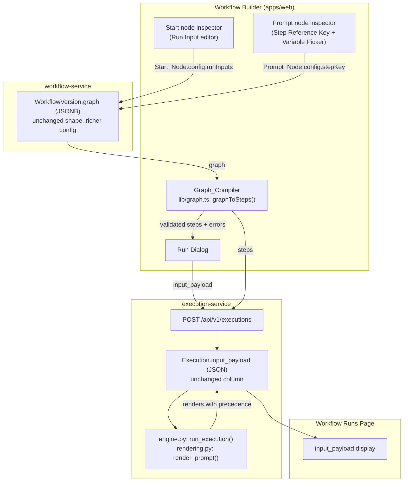
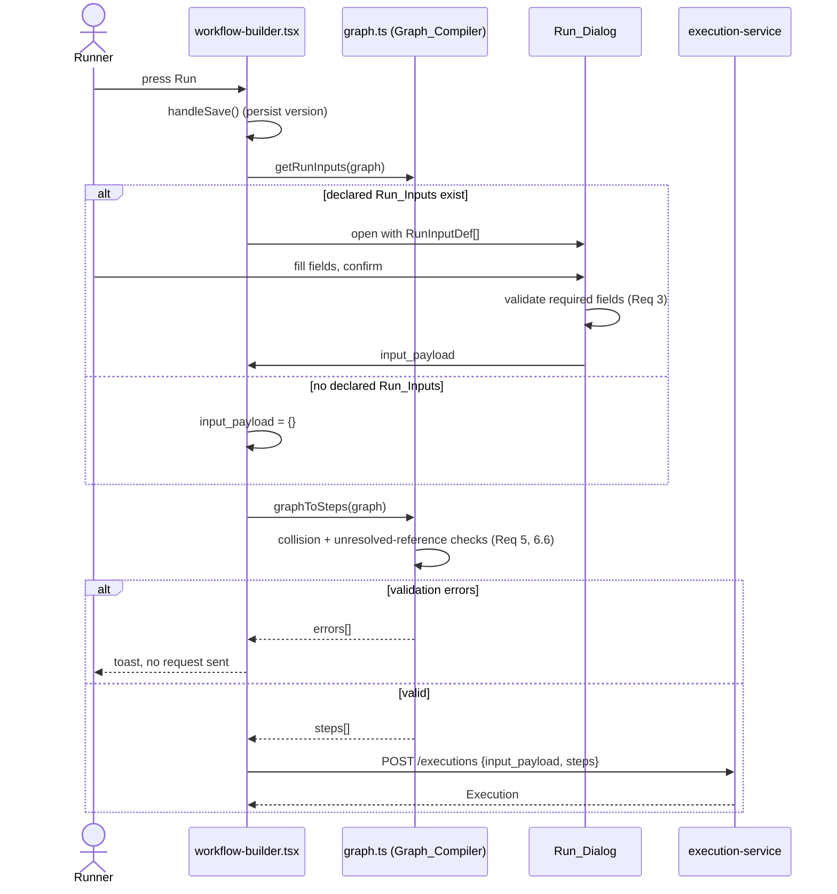
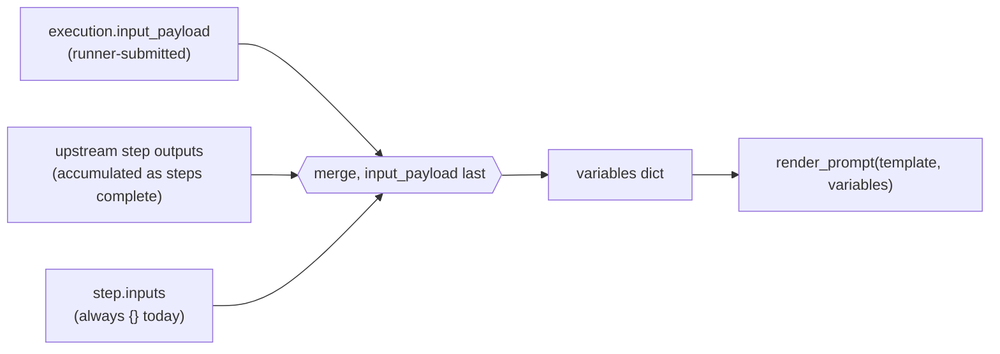

# Design Document

## Overview

Today a `WorkflowGraph` is a fixed script: every run renders the same prompt
text, and a prompt can only reference an upstream step by typing that step's
raw node id run through `toStepKey()` (e.g. `prompt_lx8z1k`), which is never
shown anywhere in the UI. This feature adds two closely related capabilities
on top of the existing, unchanged `WorkflowGraph` JSONB shape and the
existing `Execution.input_payload` column:

1. **Run Inputs** — a workflow author declares named, typed inputs on the
   Start node. A runner is asked to fill in a small form (the **Run
   Dialog**) built from those declarations before an execution starts, and
   the collected values flow into `input_payload`.
2. **Variables** — a workflow author gives a Prompt node a human-readable
   **Step Reference Key** instead of relying on the generated node id, and
   picks variable references (Run Inputs and upstream steps) from a
   **Variable Picker** instead of typing them by hand.

Both are additive to `NodeConfig` (stored inside `WorkflowVersion.graph`
JSONB) and to `Execution.input_payload` (already `JSON`/`dict[str, Any]`).
**No backend schema migration is required** — `workflow_service.models` and
`execution_service.models` already store these fields as untyped JSON(B).
The work is concentrated in `apps/web/src/lib/graph.ts` (compilation and
validation), a handful of new/edited React components, and
`execution_service/engine.py` (rendering and precedence).

Two pre-existing gaps in `engine.py` block correctness and must be fixed as
part of this feature (see Architecture and Components below):

- `_render_prompt`'s regex (`\{([A-Za-z_][A-Za-z0-9_]*)\}`) does not
  correctly reject doubled (`{{x}}`) or nested (`{a{b}c}`) braces — it will
  happily substitute the *inner* `{x}`/`{b}` it finds nested inside them.
  Requirement 4.6 requires these to be left completely literal.
- The engine seeds its per-run `context` dict from `input_payload` and then
  overwrites `context[step_key] = outputs` as each step completes. If a
  step's key ever collided with an input key, the **later write would win**
  — the opposite of the precedence Requirement 4.5 mandates (`input_payload`
  must always win). The client-side collision check (Requirement 5) prevents
  this for graphs built in the Workflow Builder, but the execution service
  has no knowledge of "Run Input" as a concept and accepts raw
  `input_payload`/`steps` from any caller, so the engine must enforce the
  precedence itself rather than relying on the client.

## Architecture

### Where each concern lives



Nothing here requires a new service or a new table. The Run Input
declarations and Step Reference Keys are just more data inside
`NodeConfig`, which is already `dict[str, Any]`/JSONB end to end
(`WorkflowNode.config`, `WorkflowVersion.graph`). The `input_payload` column
on `Execution` already exists and is already threaded into the engine's
rendering context (`engine.py: run_execution`); this feature changes *how*
that threading is done, not the column.

### Run sequence (Run Dialog path)



### Render-time precedence (execution-service)



`input_payload` is merged **last** into the per-step `variables` dict for
every step, every time, so it always wins regardless of write order or step
completion order. See Components and Interfaces for the exact code change.

## Components and Interfaces

### Frontend types (`apps/web/src/types/index.ts`)

```ts
export type RunInputFieldType = 'text' | 'textarea' | 'number' | 'select'

/** Stored inside a Start_Node's NodeConfig.runInputs, in declaration order. */
export interface RunInputDef {
  key: string // Run_Input_Key: ^[A-Za-z_][A-Za-z0-9_]*$, <= 64 chars
  label: string // <= 200 chars
  fieldType: RunInputFieldType
  required: boolean // defaults to false when absent
  defaultValue?: string | number
  helpText?: string // <= 500 chars
  placeholder?: string // <= 200 chars
  options?: string[] // required + 1..100 unique entries iff fieldType === 'select'
}

export interface NodeConfig {
  model?: string
  prompt?: string
  temperature?: number
  /** Start_Node only. Declared Run_Inputs, in author-defined order. */
  runInputs?: RunInputDef[]
  /** Prompt_Node only. Overrides the toStepKey(node.id)-derived key. */
  stepKey?: string
}
```

`GraphNode`, `WorkflowGraph`, `Execution` (`input_payload: Record<string,
unknown> | null`) are unchanged — this is purely additive to `NodeConfig`.

### `apps/web/src/lib/run-inputs.ts` (new)

Pure, framework-free logic for declaring and validating Run Inputs, and for
turning Run Dialog form state into an `input_payload`. Kept separate from
`graph.ts` because it has no dependency on edges/steps — it only reads a
Start node's `config.runInputs`.

```ts
export const RUN_INPUT_KEY_PATTERN = /^[A-Za-z_][A-Za-z0-9_]*$/
export const MAX_RUN_INPUTS = 50

/** The graph's single Start_Node, if any. */
export function getStartNode(graph: WorkflowGraph): GraphNode | undefined

/** Declared Run_Inputs in order; [] for absent/null/empty config (Req 10.1). */
export function getRunInputs(graph: WorkflowGraph): RunInputDef[]

/**
 * Validates one candidate Run_Input against its would-be siblings.
 * Returns [] when valid, or human-readable reasons otherwise (Req 1.2-1.12).
 * Checks: non-empty/length-bounded key & label, key pattern, key uniqueness
 * against `siblings`, fieldType enum, select option count/uniqueness,
 * defaultValue conformance to fieldType, and the 50-Run_Input ceiling.
 */
export function validateRunInput(
  candidate: RunInputDef,
  siblings: RunInputDef[]
): string[]

/**
 * Builds an Execution_Request's input_payload from Run_Dialog form state
 * (Req 8.1, 8.2): one entry per declared Run_Input, number-typed for
 * fieldType 'number', string otherwise, '' for a blank field with no default.
 */
export function buildInputPayload(
  defs: RunInputDef[],
  formValues: Record<string, string>
): Record<string, unknown>

/** True iff `value` is missing/empty/all-whitespace (Req 3.1, 3.2). */
export function isBlank(value: string | undefined): boolean
```

### `apps/web/src/lib/graph.ts` (edited)

`executableAncestors` is promoted from a closure inside `graphToSteps` to a
standalone, exported, graph-scoped function — the Variable Picker needs the
exact same upstream-reachability computation the engine's dependency
resolution already uses (Glossary: *Upstream_Variable*).

```ts
/** Prompt_Node ids transitively reachable upstream through non-executable
 *  nodes, stopping at the first executable ancestor on each path (same walk
 *  graphToSteps already performs for depends_on). */
export function executableAncestors(graph: WorkflowGraph, nodeId: string): string[]

/** A Prompt_Node's Step_Reference_Key: its custom config.stepKey if set and
 *  non-empty, else toStepKey(node.id) (Req 6.1, 6.2, 6.7). */
export function stepReferenceKey(node: GraphNode): string
```

`graphToSteps` changes:
- Uses `stepReferenceKey(node)` instead of `toStepKey(node.id)` when
  assigning `step_key` and `depends_on`, so custom keys flow into the
  Execution_Request.
- After building `steps`, runs three additional checks, appending to the
  same `errors: string[]` returned today (the existing "no prompt text" /
  "duplicate step keys" checks are unchanged and run alongside these):
  1. **Reference-key collisions** (Req 5, 6.4): build the set of
     `RunInputDef.key` from `getRunInputs(graph)` and the set of
     `stepReferenceKey(node)` across all Prompt nodes; report every key
     present in both, and every Step_Reference_Key duplicated across two or
     more Prompt nodes.
  2. **Reference-key well-formedness** (Req 6.3, defense in depth — the
     Prompt node inspector already blocks this at entry time): report any
     Step_Reference_Key not matching `RUN_INPUT_KEY_PATTERN` or over 64
     characters.
  3. **Unresolved placeholder references** (Req 6.6): for each Prompt node,
     extract every recognised `{name}` placeholder from its prompt text
     using the same maximal/non-nested placeholder rule the engine uses
     (see `rendering.py` below, mirrored client-side — see note), and
     report any `name` that is not in that node's own
     `Run_Input_Keys ∪ executableAncestors(...).map(stepReferenceKey)`.

  When any of 1-3 fire, `graphToSteps` returns those errors instead of a
  runnable `steps` list (mirroring the existing "no steps" precedent), which
  `useRunWorkflow` already turns into a `GraphValidationError` shown via
  toast — no new error-plumbing is needed (Req 5.3, 6.4).

  *Note on duplicating the placeholder-extraction rule client-side*: the
  client only needs to *extract candidate names* to validate references, not
  render text, so it uses a small helper (`extractPlaceholders(template):
  string[]`, exported from `graph.ts`) implementing the same "maximal,
  non-nested, non-doubled" rule as `rendering.render_prompt`, but returning
  names instead of substituting them. Keeping the rule identical on both
  sides is what makes Requirement 6.6 ("unresolved reference") and
  Requirement 4.6 ("recognised placeholder") consistent; this is called out
  explicitly in Testing Strategy.

### `apps/web/src/components/workflow/run-input-editor.tsx` (new)

Renders inside the Start node inspector panel in `workflow-builder.tsx`
(replacing the current "only Prompt nodes call a model" branch for
`nodeType === 'start'`). A list of rows, each row a `RunInputDef` with
label/key/type/required/default/help/placeholder/options fields; "Add Run
Input" is disabled once `runInputs.length === MAX_RUN_INPUTS`; rows support
reorder (up/down) and remove. Each row calls `validateRunInput` on change
and shows inline errors next to the offending field(s) (Req 1.8-1.12);
committing an edited row is blocked while it fails validation. On any
change, calls `updateSelectedConfig({ runInputs: nextDefs })`, the same
config-patching path prompt nodes already use.

### `apps/web/src/components/workflow/variable-picker.tsx` (new)

```ts
interface VariablePickerProps {
  entries: string[] // Run_Input_Keys ∪ upstream Step_Reference_Keys (Req 7.1, 7.2)
  targetRef: React.RefObject<HTMLTextAreaElement>
  value: string
  onChange: (next: string) => void
}
```

A `DropdownMenu` (existing `components/ui/dropdown-menu.tsx`) trigger button
placed next to the Prompt textarea. Renders an empty-state item ("No
variables available yet") when `entries` is empty rather than hiding the
picker (Req 7.6). Selecting an entry `key` inserts `` `{${key}}` `` using the
target textarea's `selectionStart`/`selectionEnd` (defaulting to
`value.length` when the element has never been focused, which covers "no
established cursor" — Req 7.5), replacing any active selection (Req 7.3) or
inserting at the cursor otherwise (Req 7.4), then restores focus with the
cursor placed immediately after the inserted placeholder.

In `workflow-builder.tsx`, the Prompt node inspector computes:

```ts
const graph = buildGraph()
const runInputKeys = getRunInputs(graph).map((d) => d.key)
const upstreamKeys = executableAncestors(graph, selected.id).map((id) =>
  stepReferenceKey(graph.nodes.find((n) => n.id === id)!)
)
const entries = [...runInputKeys, ...upstreamKeys] // excludes selected's own key by construction
```

and passes `entries` to `VariablePicker`, replacing the current static hint
paragraph (`Reference an upstream prompt node's output with {...}`).

### `apps/web/src/components/workflow/run-dialog.tsx` (new)

```ts
interface RunDialogProps {
  runInputs: RunInputDef[] // pre-sorted, declaration order
  onCancel: () => void
  onConfirm: (inputPayload: Record<string, unknown>) => void
}
```

Built on `components/ui/dialog.tsx`. Local state: `values:
Record<string, string>` seeded from each `RunInputDef.defaultValue` (Req
2.3), and `invalid: Record<string, boolean>`. Renders one field per
`RunInputDef` in array order (Req 2.2), `text`/`number` as `Input`,
`textarea` as `Textarea`, `select` as the existing `Select` component
restricted to `options` (Req 2.4). On confirm: for every `required` def,
`isBlank(values[key])` marks that key invalid (Req 3.1); if any are
invalid, the dialog stays open, shows a visible error style + message per
invalid field, and leaves `values` untouched (Req 3.2, 3.4); otherwise calls
`onConfirm(buildInputPayload(runInputs, values))` (Req 3.3, 2.6). Typing a
non-whitespace value into a currently-invalid required field clears that
field's invalid flag immediately (Req 3.5). The dialog's `onOpenChange` (via
Radix's built-in Escape/overlay-click/close-button handling) calls
`onCancel` for any non-confirm dismissal, which never calls `onConfirm` (Req
2.7).

### `workflow-builder.tsx` (edited)

`handleRun` no longer directly builds and submits the request. It now:

```ts
const handleRun = async () => {
  if (!activeId) return
  const id = await handleSave()
  if (!id) return
  const graph = buildGraph()
  const declared = getRunInputs(graph)
  if (declared.length > 0) {
    setPendingRun({ workflowId: id, graph }) // Req 2.1
    return
  }
  await submitRun(id, graph, {}) // Req 2.5, 8.2
}

const submitRun = async (
  workflowId: string,
  graph: WorkflowGraph,
  inputPayload: Record<string, unknown>
) => {
  try {
    const execution = await runWorkflow.mutateAsync({
      workspaceId: activeId!,
      workflowId,
      graph,
      inputPayload,
    })
    setRunId(execution.id)
    toast({ title: 'Run started', description: `Execution ${execution.id.slice(0, 8)}` })
  } catch (err) {
    toast({ title: 'Run failed', description: errorMessage(err), variant: 'destructive' })
  }
}
```

`pendingRun` (new `useState<{ workflowId: string; graph: WorkflowGraph } |
null>`) conditionally renders `<RunDialog>`:

```tsx
{pendingRun && (
  <RunDialog
    runInputs={getRunInputs(pendingRun.graph)}
    onCancel={() => setPendingRun(null)}
    onConfirm={(payload) => {
      const { workflowId, graph } = pendingRun
      setPendingRun(null)
      submitRun(workflowId, graph, payload)
    }}
  />
)}
```

`useRunWorkflow` (`hooks/workflows.ts`) is unchanged — it already accepts
and threads an optional `inputPayload` through to the POST body; this design
just ensures the Run Dialog's collected values reach that existing
parameter (Req 8.1, 8.2).

### `apps/web/src/lib/input-payload-display.ts` (new)

Small pure helpers extracted for testability, used by the Runs page:

```ts
export type InputValueKind = 'scalar' | 'array' | 'object'

/** For Req 9.1: distinguishes scalars from nested objects/arrays for display. */
export function classifyInputValue(value: unknown): InputValueKind

/** For Req 9.2 / 10.3: true for null/undefined/absent or an empty object. */
export function hasNoInputs(payload: Record<string, unknown> | null | undefined): boolean
```

### `apps/web/src/pages/workflow-runs.tsx` (edited)

Each run `Card` gains an "Inputs" block, inserted after the existing header
and before the per-step list:

```tsx
{hasNoInputs(run.input_payload) ? (
  <p className="text-sm text-muted-foreground">No inputs</p>
) : (
  <dl className="grid grid-cols-[auto,1fr] gap-x-3 gap-y-1 text-sm">
    {Object.entries(run.input_payload!).map(([key, value]) => (
      <Fragment key={key}>
        <dt className="font-medium text-muted-foreground">{key}</dt>
        <dd>
          {classifyInputValue(value) === 'scalar' ? (
            String(value)
          ) : (
            <pre className="whitespace-pre-wrap text-xs">{JSON.stringify(value, null, 2)}</pre>
          )}
        </dd>
      </Fragment>
    ))}
  </dl>
)}
```

Iterating `Object.entries(run.input_payload)` directly — rather than
looking values up by the *current* graph's declared `RunInputDef`s — is
what makes an orphaned key (Req 9.3: a key whose declaration was since
removed from the Start node) display correctly with no special-casing: the
payload is always the source of truth for what's shown, never the live
graph. `hasNoInputs` covers `null`, `undefined`, and `{}` uniformly (Req
9.2, 10.3), so a legacy execution with `input_payload: null` renders the
same "No inputs" state without throwing (Req 10.3).

### `services/execution-service/src/execution_service/rendering.py` (new)

Extracted from `engine.py` so the placeholder-substitution algorithm gets
its own focused, heavily property-tested module (`_render_prompt` today is
private and untested beyond the engine's own integration tests).

```python
_IDENT_START = re.compile(r"[A-Za-z_]")
_IDENT_CHAR = re.compile(r"[A-Za-z0-9_]")


def render_prompt(template: str, variables: dict[str, Any]) -> str:
    """Substitute maximal, non-nested ``{name}`` placeholders.

    A single left-to-right bracket-matching pass identifies which `{`/`}`
    pairs are "top level" (not nested inside another still-open `{`); a
    second pass substitutes a top-level pair only when its content is a
    valid identifier, it is not immediately adjacent to another brace
    (``{{``/``}}``), and the identifier is a known variable. Every other
    brace -- unmatched, nested, doubled, or referencing an unknown key -- is
    copied through unchanged. This never raises: the two passes are pure
    index arithmetic over `template`, and every substituted value is a
    JSON-decoded type (str/int/float/bool/None/dict/list), so `str(value)`
    cannot raise either.
    """
    if not template:
        return ""

    n = len(template)
    open_stack: list[int] = []
    top_level_pairs: dict[int, int] = {}

    for i, ch in enumerate(template):
        if ch == "{":
            open_stack.append(i)
        elif ch == "}":
            if not open_stack:
                continue  # unmatched '}': leave as literal text
            open_idx = open_stack.pop()
            if not open_stack:
                top_level_pairs[open_idx] = i
            # else: nested inside an outer, still-open '{' -- not recorded,
            # so it will be copied through literally in the pass below.

    def is_identifier(name: str) -> bool:
        return bool(name) and bool(_IDENT_START.match(name[0])) and all(
            _IDENT_CHAR.match(c) for c in name[1:]
        )

    result: list[str] = []
    i = 0
    while i < n:
        close_idx = top_level_pairs.get(i)
        if close_idx is not None:
            name = template[i + 1 : close_idx]
            doubled = (i > 0 and template[i - 1] == "{") or (
                close_idx + 1 < n and template[close_idx + 1] == "}"
            )
            if is_identifier(name) and not doubled and name in variables:
                result.append(_stringify(variables[name]))
                i = close_idx + 1
                continue
        result.append(template[i])
        i += 1

    return "".join(result)


def _stringify(value: Any) -> str:
    if isinstance(value, dict) and "text" in value:
        return str(value["text"])
    return str(value)


def extract_placeholder_names(template: str) -> set[str]:
    """Names of every recognised placeholder in `template` (used for
    unresolved-reference validation; substitutes against `{n: n for n in
    ...}` so every syntactically valid identifier is treated as 'known'."""
    names: set[str] = set()
    render_prompt(template, _AllKnown(names))
    return names


class _AllKnown(dict):
    """A dict-like that reports every key as present and records it, so
    render_prompt's substitution pass doubles as name extraction without
    duplicating the bracket-matching logic."""

    def __init__(self, sink: set[str]) -> None:
        super().__init__()
        self._sink = sink

    def __contains__(self, key: object) -> bool:
        self._sink.add(str(key))
        return True

    def __getitem__(self, key: object) -> Any:
        return ""
```

*Note on an ambiguous edge case*: Requirement 4.6 does not give a worked
example for a placeholder immediately followed by a stray extra brace
(e.g. `{name}}`, one valid pair plus one unmatched trailing `}`). The
`doubled` check above treats that trailing `}}` run as disqualifying,
leaving the whole thing literal, which is the more conservative reading of
"any substring containing doubled brace characters ... shall be treated as
literal." The shared fixture table described in Testing Strategy pins this
down concretely so both the backend and the client-side extractor agree,
and this specific case is called out for confirmation during review.

`engine.py` changes:

```python
from src.execution_service.rendering import render_prompt

async def _run_step_with_retries(
    session: AsyncSession,
    execution: Execution,
    step: ExecutionStep,
    upstream_outputs: dict[str, Any],
    input_payload: dict[str, Any],
    max_retries: int = 2,
) -> dict[str, Any]:
    provider = get_provider(step.provider)
    # input_payload is merged last so it always wins over an upstream
    # step's output when a key is present in both (Req 4.5), regardless of
    # step completion order -- this does not rely on the client-side
    # collision check (Req 5), which only applies to graphs built in the
    # Workflow Builder.
    variables = {**(step.inputs or {}), **upstream_outputs, **input_payload}
    rendered = render_prompt(step.prompt or "", variables)
    ...  # unchanged retry loop, using `rendered`


async def run_execution(execution_id: Any, max_retries: int = 2) -> None:
    async with AsyncSessionLocal() as session:
        execution = await _load_execution(session, execution_id)
        ...
        input_payload = dict(execution.input_payload or {})
        upstream_outputs: dict[str, Any] = {}
        context: dict[str, Any] = dict(input_payload)  # unchanged output_payload shape

        try:
            ordered = await _topological_steps(list(execution.steps))
            for step in ordered:
                ...
                outputs = await _run_step_with_retries(
                    session, execution, step, upstream_outputs, input_payload,
                    max_retries=max_retries,
                )
                upstream_outputs[step.step_key] = outputs
                context[step.step_key] = outputs  # preserves existing output_payload behavior

            execution.output_payload = context
            ...
```

`output_payload`'s shape (inputs + all step outputs, merged) is
deliberately left unchanged — it isn't read anywhere in the frontend today
(`grep` confirms only the type declaration exists), and this design keeps
the blast radius limited to fixing the *rendering* precedence, not the
persisted shape of `output_payload`.

`ExecutionCreate`, `ExecutionStepCreate`, and every SQLAlchemy model in both
`workflow_service` and `execution_service` are unchanged: `config`, `graph`,
and `input_payload` are already `dict[str, Any]` / JSON(B) columns, so the
new `runInputs`/`stepKey` keys and the richer `input_payload` values pass
through the existing Pydantic schemas without a new field or a migration.

## Data Models

No new tables or columns. Summary of where each new piece of data lives:

| Data | Type | Storage |
|---|---|---|
| `RunInputDef[]` | `NodeConfig.runInputs` | `WorkflowVersion.graph` (JSONB), on the Start_Node |
| Custom `Step_Reference_Key` | `NodeConfig.stepKey` (`string`) | `WorkflowVersion.graph` (JSONB), on a Prompt_Node |
| Collected run values | `Record<string, unknown>` | `Execution.input_payload` (JSON), unchanged column |

`graphToSteps`'s output (`ExecutionStepPayload.step_key`) is derived from
`stepReferenceKey(node)` instead of `toStepKey(node.id)` directly, but its
shape (`step_key`, `depends_on`, `provider`, `model_key`, `prompt`,
`inputs`) is unchanged, so `ExecutionStepCreate` needs no changes.

## Correctness Properties

*A property is a characteristic or behavior that should hold true across
all valid executions of a system — essentially, a formal statement about
what the system should do. Properties serve as the bridge between
human-readable specifications and machine-verifiable correctness
guarantees.*

### Property 1: Run_Input acceptance is a well-formedness predicate

For any candidate `RunInputDef` and any list of sibling `RunInputDef`s
already declared on the same Start_Node, the Workflow_Builder SHALL accept
adding the candidate if and only if: its key is non-empty, at most 64
characters, matches `^[A-Za-z_][A-Za-z0-9_]*$`, and is not already used by a
sibling; its label is non-empty and at most 200 characters; its `fieldType`
is one of `text`, `textarea`, `number`, `select`; when `fieldType` is
`select`, its `options` has between 1 and 100 pairwise-distinct entries;
any `defaultValue` conforms to `fieldType` (parses as a number for
`number`, is one of `options` for `select`); and the sibling count is below
50.

**Validates: Requirements 1.2, 1.3, 1.9, 1.10, 1.11, 1.12**

### Property 2: Run_Input declarations round-trip through storage

For any list of at most 50 valid `RunInputDef`s, serializing them into a
Start_Node's `config.runInputs`, saving, reloading, and deserializing SHALL
produce an equivalent list — same order, keys, labels, types, defaults,
help text, placeholders, and required flags.

**Validates: Requirements 1.1, 1.4, 1.5, 1.6, 1.7**

### Property 3: Run_Dialog visibility and content are fully determined by the graph

For any Workflow_Graph, the Run_Dialog is displayed before submission if
and only if the graph's Start_Node declares at least one Run_Input; when
displayed, it renders exactly one field per declared Run_Input, in
declaration order, pre-filled with that Run_Input's default value when one
is set, and — for `select` fields — restricted to that Run_Input's declared
options.

**Validates: Requirements 2.1, 2.2, 2.3, 2.4, 2.5**

### Property 4: A Run_Input is marked invalid, and submission is blocked, exactly when a required value is blank

For any set of declared Run_Inputs and any submitted form values, a
Run_Input SHALL be marked invalid if and only if it is `required` and its
submitted value is missing, an empty string, or all-whitespace; submission
SHALL be blocked if and only if at least one Run_Input is marked invalid.

**Validates: Requirements 3.1, 3.2, 3.3, 3.4, 3.5**

### Property 5: Blocking a submission does not alter other fields

For any Run_Dialog submission blocked by one or more invalid required
Run_Inputs, the submitted value of every *other* Run_Input SHALL remain
exactly as it was entered.

**Validates: Requirements 3.2**

### Property 6: Rendering is the identity when no placeholder resolves, and is idempotent on that output

For any template string containing no recognised placeholder that matches
a key resolvable from `input_payload` or upstream-produced outputs,
rendering SHALL return the template unchanged, and rendering that output a
second time SHALL produce the same string again.

**Validates: Requirements 4.3**

### Property 7: Rendering never raises

For any template string, any `input_payload`, and any set of
upstream-produced outputs, rendering SHALL never raise an exception,
regardless of unmatched braces, nested braces, doubled braces, or
non-string variable values.

**Validates: Requirements 4.6, 4.7**

### Property 8: `input_payload` takes precedence over upstream output for the same key

For any key present in both `input_payload` and an upstream-produced
output, rendering SHALL produce the same result as rendering with only the
`input_payload` value present for that key.

**Validates: Requirements 4.4, 4.5**

### Property 9: A `{"text": v}` value and the plain string `v` render identically

For any template and any resolved variable, replacing a variable's dict
value `{"text": v}` with the plain string `v` SHALL produce the same
rendered output.

**Validates: Requirements 4.1, 4.2**

### Property 10: Accepted graphs have a well-formed, collision-free key namespace

For any Workflow_Graph accepted (without a validation error) by the
Graph_Compiler, the set of Run_Input_Keys and the set of Step_Reference_Keys
SHALL be pairwise disjoint, and each of those two sets SHALL individually
contain no duplicate values.

**Validates: Requirements 5.1, 5.2, 6.4**

### Property 11: Every recognised placeholder in an accepted graph resolves to a declared name

For any Workflow_Graph and any Prompt_Node whose prompt text contains a
recognised `{name}` placeholder, the Graph_Compiler SHALL accept the graph
only if `name` is either a declared Run_Input_Key or the Step_Reference_Key
of one of that Prompt_Node's Upstream_Variables, and SHALL otherwise report
an unresolved-reference error naming it.

**Validates: Requirements 6.6**

### Property 12: A Prompt_Node's derived Step_Reference_Key is stable and matches `toStepKey`

For any Prompt_Node lacking a custom Step_Reference_Key, the Graph_Compiler's
derived key SHALL equal `toStepKey(node.id)`, and compiling the same,
unmodified graph twice SHALL produce that same key both times.

**Validates: Requirements 6.2, 6.7**

### Property 13: Renaming a Step_Reference_Key does not rewrite other prompts

For any Workflow_Graph containing a prompt that references `{oldKey}`, and
any subsequent rename of a (possibly different) Prompt_Node's
Step_Reference_Key, the text of that prompt SHALL remain unchanged.

**Validates: Requirements 6.5**

### Property 14: The Variable_Picker's entries are exactly the Run_Inputs plus upstream steps

For any Workflow_Graph and any Prompt_Node, the set of entries offered by
the Variable_Picker SHALL equal the union of the graph's Run_Input_Keys and
the Step_Reference_Keys returned by `executableAncestors()` for that
Prompt_Node, and SHALL never include that Prompt_Node's own
Step_Reference_Key.

**Validates: Requirements 7.1, 7.2**

### Property 15: Inserting a variable reference adds exactly one placeholder and preserves surrounding text

For any insertion triggered from the Variable_Picker — whether there is an
active text selection, a cursor position with no selection, or no
established cursor at all — the resulting prompt text SHALL contain the
inserted `{key}` placeholder exactly one more time than before the
insertion, and all prompt text outside the replaced or insertion point
SHALL remain unchanged.

**Validates: Requirements 7.3, 7.4, 7.5**

### Property 16: The submitted `input_payload` is exactly the collected Run_Input values

For any set of Run_Input values collected in the Run_Dialog, the
`input_payload` of the resulting Execution_Request SHALL contain a value
for every declared Run_Input_Key equal to the collected value, represented
as a number for `number` fields and a string otherwise, and SHALL contain
no additional keys.

**Validates: Requirements 8.1, 8.2**

### Property 17: An `input_payload` key remains resolvable at every step of an execution

For any `input_payload` and any ordered list of N Execution_Steps (N ≥ 1),
for every step index *i* in `[0, N)`, rendering step *i*'s prompt with a
placeholder matching an `input_payload` key SHALL resolve to that
`input_payload` value, regardless of *i* or of how many steps have already
completed.

**Validates: Requirements 8.3**

### Property 18: The Runs Page's value classifier matches JSON's own structure

For any JSON-compatible value, the Workflow_Runs_Page's value-kind
classifier SHALL report `'array'` if and only if the value is an array,
`'object'` if and only if the value is a non-array, non-null object, and
`'scalar'` otherwise.

**Validates: Requirements 9.1**

### Property 19: The "no inputs" predicate matches null, undefined, and empty-object payloads exactly

For any `input_payload`, the Workflow_Runs_Page's no-inputs predicate SHALL
return `true` if and only if the payload is `null`, `undefined`, or an
object with zero own enumerable keys.

**Validates: Requirements 9.2, 10.3**

## Error Handling

- **Author-time, per-field (Requirements 1.8-1.12, 6.3)**: the Run_Input
  editor and the Prompt node's Step_Reference_Key field validate on every
  change (`validateRunInput`, and a shared pattern/length check for
  `stepKey`) and show an inline message identifying which rule failed.
  Committing an invalid row/field is disabled rather than silently dropped,
  so the author's in-progress text is never discarded. This is local React
  state validation — it does not touch the network.
- **Compile-time, whole-graph (Requirements 5, 6.4, 6.6, and the pre-existing
  "no prompt text" / "duplicate step key" checks)**: `graphToSteps` collects
  every violation into one `errors: string[]` rather than failing fast, so
  an author sees all problems at once. `useRunWorkflow` wraps a non-empty
  `errors` list in the existing `GraphValidationError`, which
  `workflow-builder.tsx`'s existing `errorMessage()` helper already unwraps
  into a toast (`err.errors.join(' ')`) — no new error-handling path is
  introduced, only new error strings feeding the existing one. Per
  Requirement 5.3/6.4, this happens *before* `POST /api/v1/executions` is
  ever called, so an invalid graph never reaches the execution service.
- **Run_Dialog submission (Requirement 3)**: blocked submissions never
  leave the client — no request is sent, no error surfaces from the API;
  the dialog itself shows which fields are invalid and stays open.
- **Rendering (Requirement 4.7)**: `render_prompt` is a total function by
  construction (Property 7) — there is no error path to handle at render
  time. A step's *model call* can still fail (rate limits, bad model id,
  etc.), which is unrelated to this feature and already handled by
  `_friendly_error`/`_retry_delay` in `engine.py`.
- **Legacy data (Requirement 10)**: `getRunInputs` treats an absent, `null`,
  or empty-array `config.runInputs` as zero Run_Inputs rather than throwing
  or treating it as an error; `hasNoInputs` treats a `null` or absent
  `input_payload` the same way. Both are plain functions with no
  exception-throwing branch for these cases, so a pre-existing workflow or
  execution loads exactly as it did before this feature shipped.

## Testing Strategy

**Property-based testing applies** to this feature: `render_prompt`,
`extract_placeholder_names`, `graphToSteps`'s validation rules,
`stepReferenceKey`/`executableAncestors`, `validateRunInput`,
`buildInputPayload`, `classifyInputValue`, and `hasNoInputs` are all pure
functions with input spaces large enough (arbitrary strings, arbitrary
graphs, arbitrary JSON values) that generated inputs will find edge cases
example-based tests would miss — brace placement, Unicode in keys,
deeply-nested JSON, cyclic-looking dependency chains, etc. UI *rendering*
(the Run_Dialog's JSX, the Variable_Picker's dropdown, the Runs Page's
layout) is not: it is exercised with React Testing Library example-based
tests instead, per the existing `pages/__tests__/landing.test.tsx`
convention.

- **Frontend property tests**: [fast-check](https://fast-check.dev/) (new
  devDependency, pinned exact version), run through Vitest
  (`fast-check` integrates directly with any test runner — no
  `@fast-check/*` adapter needed for Vitest). Each property test sets
  `numRuns: 100` explicitly (fast-check's default is already 100, but the
  requirement is made explicit in code per Requirement's Property Test
  Configuration).
- **Backend property tests**: [Hypothesis](https://hypothesis.readthedocs.io/)
  (new addition to `requirements-dev.txt`, pinned exact version), run
  through `pytest` (already the project's runner). Each `@given(...)` test
  sets `@settings(max_examples=100)` explicitly.
- Each property test is tagged with a comment in the format **Feature:
  run-inputs-and-variables, Property {number}: {property text}**,
  referencing the numbered property above it implements, and implements
  exactly one property from this document (no test covers more than one
  numbered property).
- **Unit/example tests** cover: legacy fixture graphs with no `runInputs`
  and no `stepKey` compiling to the same steps as before this feature
  (Requirement 10.2, regression-style, reusing Property 12's guarantee
  concretely); an orphaned `input_payload` key still rendering on the Runs
  Page (Requirement 9.3); Run_Dialog Cancel/Escape/close-button never
  submitting (Requirement 2.7); the specific error strings surfaced for a
  few representative invalid Run_Input shapes (Requirement 1.10); and the
  friendly-error/retry-delay paths in `engine.py`, which are unrelated to
  this feature's properties and already covered by existing tests.
- **Verification gates**: per the repository `Makefile`, frontend changes
  must pass `cd apps/web && npm run lint` (ESLint), `npm run build` (which
  runs `tsc -b` before `vite build`), and `npm run test` (Vitest, includes
  the new fast-check property tests); backend changes to
  `execution-service` must pass `.venv/bin/ruff check .`, `.venv/bin/mypy
  .`, and `.venv/bin/pytest` (includes the new Hypothesis property tests)
  from `services/execution-service`.
- **Consistency check**: because `extract_placeholder_names` (backend) and
  the client-side placeholder extraction in `graph.ts` both claim to
  implement "the same maximal, non-nested placeholder rule," a shared table
  of example strings (doubled braces, nested braces, unmatched braces,
  Unicode identifiers, adjacent placeholders) is used as fixture data for
  *both* the Python and TypeScript unit tests, so a future change to one
  side's rule without the other is caught by a mismatched expectation
  rather than by production behavior diverging silently between
  compile-time validation (Requirement 6.6) and render-time substitution
  (Requirement 4.6).
